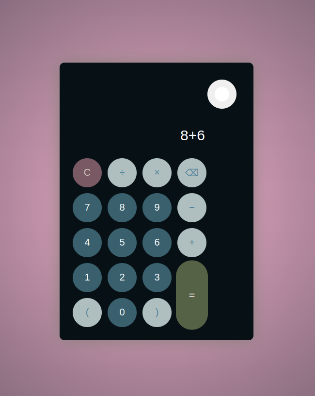

# Dark & Light Themed Calculator

## Description  
A simple, elegant calculator application built as the final project in the **Global Certification** program at [**Parul University**](https://www.paruluniversity.ac.in). Developed using **JavaScript**, it features a smooth toggle between Dark and Light themes. Users can perform basic arithmetic operations with a clean, interactive, and responsive user interface.

## Features:
- **Basic Arithmetic Operations:** Perform addition, subtraction, multiplication, and division easily.
- **Dark and Light Modes:** Switch between dark and light themes for a better user experience.
- **Interactive UI:** Clean and modern design for better usability.
  
## Technologies Used:
- **HTML**
- **CSS**
- **JavaScript**

## How to Use:
1. Clone or download the repository.
2. Open the `index.html` file in your browser.
3. Switch between themes using the toggle button.
4. Perform calculations by clicking the numbers and operators.

## Preview:
;

## Installation:
1. Clone this repository:
   ```bash
   git clone https://github.com/eldoJr/dark-light-calculator.git


